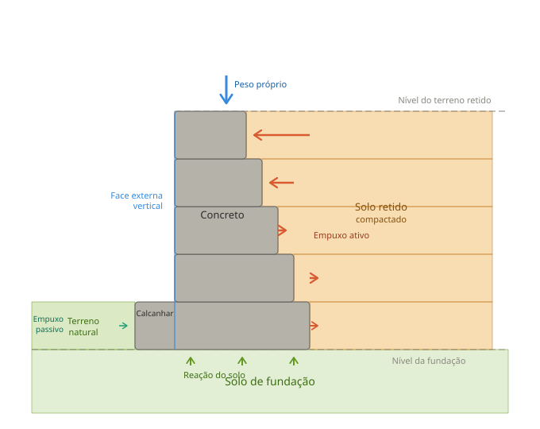
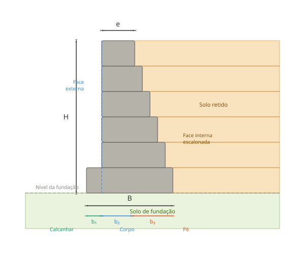

<!-- markdownlint-disable MD060 -->

# Muros de Gravidade com Perfil Escalonado

## Introdução

Muros de gravidade com perfil escalonado são estruturas de contenção que utilizam seu peso próprio para resistir aos empuxos laterais do solo. A característica distintiva é o perfil em degraus, onde a seção transversal aumenta progressivamente da parte superior (topo) até a base, criando uma forma escalonada.

### Aplicações Típicas

- Contenção de taludes em rodovias e ferrovias
- Estabilização de terrenos em obras urbanas
- Arrimos em áreas de edificação
- Obras de terraplenagem em geral

### Vantagens

- **Economia de material**: 25–40% menos concreto comparado a muros de seção constante
- **Melhor distribuição de tensões**: concentração de material onde é mais necessário
- **Execução relativamente simples**: tecnologia construtiva bem estabelecida
- **Adequado para alturas médias**: ideal para muros de 3 a 8 metros

---

## Conceitos Fundamentais

Um muro de gravidade com perfil escalonado é caracterizado por:[^11]

1. **Face externa vertical** — lado livre do muro, mantido em prumo
2. **Face interna escalonada** — lado contra o terreno, com degraus que aumentam a espessura
3. **Base alargada** — inclui o calcanhar, que avança além da face externa

### Princípio de Funcionamento

O muro resiste ao tombamento e ao deslizamento por três mecanismos principais:[^1][^2]

- **Peso próprio** — a massa do concreto gera momento resistente ao tombamento
- **Empuxo passivo** — o solo à frente do muro oferece resistência horizontal
- **Atrito na base** — interface concreto–solo impede o deslizamento

---

## Configuração Típica

### Perfil Estrutural

**Figura 1** — Perfil típico de muro de gravidade escalonado com as principais forças atuantes e componentes estruturais.

### Elementos Componentes

1. **Topo** — seção mais estreita (40–60 cm)
2. **Corpo** — degraus progressivos, com avanço típico de 20 cm por nível
3. **Base** — seção mais larga, composta por:
    - **Calcanhar** ($b_1$): projeção além da face externa, $0{,}1H$ a $0{,}2H$
    - **Corpo central** ($b_2$): sob o muro propriamente dito
    - **Pé** ($b_3$): extensão sob o terreno retido, $0{,}2H$ a $0{,}4H$

### Nomenclatura Técnica

**Figura 2** — Dimensões principais e nomenclatura técnica do muro de gravidade escalonado.

| Símbolo | Definição |
|---------|-----------|
| $H$ | Altura total do muro (da fundação ao topo) |
| $B$ | Largura total da base |
| $b_1$ | Largura do calcanhar |
| $b_2$ | Largura do corpo na base |
| $b_3$ | Largura do pé |
| $e$ | Espessura no topo |

Relação fundamental:

$$B = b_1 + b_2 + b_3$$

---

## Métodos de Pré-Dimensionamento

### Método Empírico Simplificado

Baseado em proporções estabelecidas pela prática profissional e normas técnicas.[^1][^2]

#### Relações Dimensionais Básicas

**Largura da base:**

$$B = (0{,}4 \text{ a } 0{,}7) \cdot H$$

Para uso prático:

- Solo com boa capacidade de carga: $B = 0{,}4H$ a $0{,}5H$
- Solo com capacidade média: $B = 0{,}5H$ a $0{,}6H$
- Solo com capacidade baixa: $B = 0{,}6H$ a $0{,}7H$

**Distribuição da base:**

$$b_1 = (0{,}10 \text{ a } 0{,}20) \cdot H \quad \text{(calcanhar)}$$

$$b_3 = (0{,}20 \text{ a } 0{,}40) \cdot H \quad \text{(pé)}$$

$$b_2 = B - b_1 - b_3$$

**Espessura no topo:**

$$e \geq 0{,}30 \text{ m (mínimo absoluto)}; \quad e = (0{,}05 \text{ a } 0{,}08) \cdot H \text{ (recomendado)}$$

**Dimensão dos degraus:**

$$n = 4 \text{ a } 6 \text{ degraus}; \quad h_{deg} = \frac{H}{n}; \quad \Delta b = 0{,}15 \text{ a } 0{,}25 \text{ m por degrau}$$

#### Exemplo de Aplicação — $H = 6{,}0$ m

Para solo de capacidade média ($B = 0{,}55H$):

1. Largura da base: $B = 0{,}55 \times 6{,}0 = 3{,}30$ m
2. Calcanhar: $b_1 = 0{,}15 \times 6{,}0 = 0{,}90$ m
3. Pé: $b_3 = 0{,}30 \times 6{,}0 = 1{,}80$ m
4. Corpo: $b_2 = 3{,}30 - 0{,}90 - 1{,}80 = 0{,}60$ m
5. Espessura no topo: $e = 0{,}06 \times 6{,}0 = 0{,}36$ m → adotar $0{,}40$ m
6. $n = 5$ degraus de $h_{deg} = 1{,}20$ m, avanço de $\Delta b = 0{,}20$ m por nível

| Nível | Intervalo (m) | Espessura (m) |
|-------|---------------|---------------|
| Topo  | 0,0 – 1,2     | 0,40          |
| 2     | 1,2 – 2,4     | 0,60          |
| 3     | 2,4 – 3,6     | 0,80          |
| 4     | 3,6 – 4,8     | 1,00          |
| Base  | 4,8 – 6,0     | 1,20          |

### Método de Coulomb Simplificado

Considera o equilíbrio de forças para dimensionamento preliminar.[^3]

#### Empuxo Ativo de Rankine

Para solo com superfície horizontal:

$$E_a = \frac{1}{2}\, \gamma H^2 K_a$$

Onde:

- $E_a$ — empuxo ativo horizontal (kN/m)
- $\gamma$ — peso específico do solo (kN/m³)
- $H$ — altura do muro (m)
- $K_a$ — coeficiente de empuxo ativo

O coeficiente de empuxo ativo é dado por:

$$K_a = \tan^2\!\left(45° - \frac{\varphi}{2}\right)$$

Onde $\varphi$ é o ângulo de atrito interno do solo.

#### Valores Típicos de $K_a$

| Tipo de Solo     | $\varphi$ (°) | $K_a$     |
|------------------|--------------|-----------|
| Argila mole      | 15–20        | 0,49–0,59 |
| Argila média     | 20–25        | 0,41–0,49 |
| Areia solta      | 28–30        | 0,33–0,36 |
| Areia compacta   | 30–35        | 0,27–0,33 |
| Areia densa      | 35–40        | 0,22–0,27 |
| Pedregulho       | 40–45        | 0,17–0,22 |

#### Dimensionamento pela Estabilidade ao Tombamento

O momento resistente ($M_r$) deve superar o momento tombador ($M_t$):

$$M_r = W \cdot \bar{x}; \quad M_t = E_a \cdot \frac{H}{3}$$

$$FS_{tomb} = \frac{M_r}{M_t} \geq 1{,}5$$

Onde $W$ é o peso total do muro por metro linear e $\bar{x}$ é a distância do centro de gravidade ao ponto de giro.

Peso do muro:

$$W = \gamma_{conc} \cdot V$$

com $\gamma_{conc} = 24$ kN/m³ (concreto simples) ou $25$ kN/m³ (concreto armado).

#### Exemplo de Verificação

Para $H = 6{,}0$ m, solo arenoso ($\varphi = 32°$, $\gamma = 18$ kN/m³):

1. Coeficiente de empuxo: $K_a = \tan^2(45° - 16°) = \tan^2(29°) = 0{,}307$
2. Empuxo ativo: $E_a = \frac{1}{2} \times 18 \times 6{,}0^2 \times 0{,}307 = 99{,}4$ kN/m
3. Momento tombador: $M_t = 99{,}4 \times \frac{6{,}0}{3} = 198{,}8$ kN·m/m
4. Peso estimado: $W \approx 420$ kN/m; $\bar{x} \approx 1{,}65$ m
5. Momento resistente: $M_r = 420 \times 1{,}65 = 693$ kN·m/m
6. Fator de segurança: $FS = \frac{693}{198{,}8} = 3{,}49 > 1{,}5$ ✓

### Método Gráfico de Culmann

Método semi-gráfico para determinação do empuxo considerando superfícies de ruptura.[^4] Consiste em:

1. Desenhar o perfil do muro em escala
2. Traçar possíveis superfícies de ruptura a partir da base
3. Calcular o peso do prisma de solo para cada superfície
4. Determinar a cunha crítica (máximo empuxo)
5. Calcular forças e momentos

### Tabelas de Pré-Dimensionamento

**Tabela 1** — Dimensões recomendadas por altura

| $H$ (m) | $B$ (m)   | $e_{topo}$ (m) | $e_{base}$ (m) | $b_1$ (m) | $b_3$ (m) |
|---------|-----------|----------------|----------------|-----------|-----------|
| 3,0     | 1,5 – 1,8 | 0,30           | 0,70           | 0,30      | 0,60      |
| 4,0     | 2,0 – 2,4 | 0,30           | 0,90           | 0,40      | 0,80      |
| 5,0     | 2,5 – 3,0 | 0,35           | 1,10           | 0,50      | 1,00      |
| 6,0     | 3,0 – 3,6 | 0,40           | 1,30           | 0,60      | 1,20      |
| 7,0     | 3,5 – 4,2 | 0,45           | 1,50           | 0,70      | 1,40      |
| 8,0     | 4,0 – 4,8 | 0,50           | 1,70           | 0,80      | 1,60      |

*Valores intermediários podem ser interpolados linearmente.*

**Tabela 2** — Fatores de segurança mínimos[^5]

| Verificação          | $FS$ mínimo | $FS$ recomendado |
|----------------------|-------------|-----------------|
| Tombamento           | 1,5         | 2,0             |
| Deslizamento         | 1,5         | 2,0             |
| Capacidade de carga  | 2,0         | 3,0             |
| Estabilidade global  | 1,3         | 1,5             |

---

## Verificações de Estabilidade

Após o pré-dimensionamento, o muro deve ser verificado para três modos de ruptura.[^2][^3][^9]

### Estabilidade ao Tombamento

O muro pode girar em torno do pé (ponto A na extremidade da base externa):

$$FS_{tomb} = \frac{\sum M_{res}}{\sum M_{tomb}} \geq 1{,}5$$

**Momentos resistentes** (em relação ao ponto A):

- Peso de cada seção do muro × distância ao ponto A
- Peso do solo sobre o pé × distância ao ponto A
- Componente vertical do empuxo passivo (se houver)

**Momentos tombadores:**

- Empuxo ativo × altura de aplicação ($H/3$)
- Sobrecarga × braço de momento (se houver)

### Estabilidade ao Deslizamento

O muro pode deslizar horizontalmente sobre a base:

$$FS_{desl} = \frac{\sum V \cdot \tan\delta + c \cdot B + E_p}{\sum H} \geq 1{,}5$$

Onde:

- $\sum V$ — soma das forças verticais (peso do muro + solo)
- $\delta$ — ângulo de atrito concreto–solo ($\delta \approx \frac{2}{3}\varphi$)
- $c$ — coesão do solo de fundação
- $B$ — largura da base
- $E_p$ — empuxo passivo à frente do muro
- $\sum H$ — soma das forças horizontais (empuxo ativo)

Empuxo passivo (Rankine):

$$E_p = \frac{1}{2}\,\gamma h^2 K_p; \quad K_p = \tan^2\!\left(45° + \frac{\varphi}{2}\right)$$

Onde $h$ é a altura do terreno natural à frente do muro.

### Capacidade de Carga da Fundação

A tensão na base não deve exceder a capacidade de carga do solo. Distribuição de tensões pelo método de Meyerhof:

$$\sigma_{max} = \frac{\sum V}{B}\!\left(1 + \frac{6e'}{B}\right); \quad \sigma_{min} = \frac{\sum V}{B}\!\left(1 - \frac{6e'}{B}\right)$$

Onde a excentricidade é $e' = \left|\dfrac{B}{2} - \bar{x}\right|$.

Critérios a verificar:

1. $e' \leq \dfrac{B}{6}$ — resultante no terço central
2. $\sigma_{max} \leq \sigma_{adm}$ — tensão máxima admissível do solo
3. $\sigma_{min} \geq 0$ — ausência de tração

**Tabela 3** — Capacidade de carga admissível (valores orientativos)

| Tipo de Solo      | $\sigma_{adm}$ (kPa) |
|-------------------|---------------------|
| Argila muito mole | 25–50               |
| Argila mole       | 50–100              |
| Argila média      | 100–200             |
| Argila rija       | 200–400             |
| Areia fofa        | 100–200             |
| Areia compacta    | 200–400             |
| Areia densa       | 400–600             |
| Pedregulho        | 600–1000            |
| Rocha alterada    | 1000–3000           |

*Valores precisos devem ser obtidos por ensaios geotécnicos.*

---

## Considerações Construtivas

### Drenagem

A drenagem é fundamental para a longevidade do muro.

**Sistema de drenagem interna:**

- Drenos horizontais: tubos de PVC perfurados (∅ 50–75 mm) atravessando o muro
- Espaçamento: 1,5 a 2,0 m horizontal e vertical
- Inclinação mínima de 2% em direção à face externa
- Saída por barbacãs ou tubos aparentes na face

**Sistema de drenagem vertical:**

- Material drenante: brita graduada ou geocomposto drenante
- Espessura mínima de 30 cm atrás do muro
- Geotêxtil separador entre solo e material drenante

**Proteção superficial:**

- Topo do muro impermeabilizado com caimento
- Canaletas de captação de águas superficiais
- Descidas d'água para evitar erosão na face

### Materiais

**Concreto:**

- Resistência mínima: $f_{ck} = 20$ MPa
- Consumo de cimento: ≥ 300 kg/m³
- Cobrimento: 3–4 cm conforme condição de exposição
- Slump: 80 ± 20 mm

**Aterro compactado:**

- Solo granular, livre de matéria orgânica
- Grau de compactação ≥ 95% Proctor Normal
- Camadas de até 20–30 cm de espessura solta

### Sequência Executiva

1. Escavação até a cota de fundação, com sobre-largura para trabalho
2. Regularização e compactação do fundo
3. Lastro de concreto magro (5–10 cm)
4. Montagem das formas com face externa em prumo rigoroso
5. Armadura conforme projeto estrutural
6. Concretagem, preferencialmente em uma única etapa
7. Cura mínima de 7 dias com superfície úmida
8. Retirada de formas após ≥ 14 dias
9. Impermeabilização da face interna e do topo
10. Instalação do sistema de drenagem
11. Reaterro por camadas compactadas
12. Acabamento da face externa, se especificado

---

## Limitações e Recomendações

Para aprofundamento nos critérios de aplicação e dimensionamento de muros de arrimo, ver Gerscovich[^10] e Caputo.[^11]

**Altura máxima recomendada:**

- Muros de gravidade: até 8–10 m
- Acima de 8 m: considerar muro de flexão (cantilever) ou muro de contrafortes

**Condições de solo adequadas:**

- Capacidade de carga ≥ 150 kPa
- Fundação em rocha ou solo resistente
- Nível d'água a mais de 2 m abaixo da base

**Inadequado para:**

- Solos muito compressíveis (argila orgânica, turfa)
- Lençol freático alto sem drenagem adequada
- Encostas instáveis

**Aspectos normativos** — o projeto deve atender:[^5][^6][^7][^8][^12]

- NBR 11682: Estabilidade de Encostas
- NBR 6122: Projeto e Execução de Fundações
- NBR 6118: Projeto de Estruturas de Concreto
- NBR 9062: Estruturas de Concreto Pré-moldado

!!! warning "Aviso"
    Este documento apresenta conceitos gerais e métodos de pré-dimensionamento. **Todo projeto definitivo deve ser desenvolvido por engenheiro habilitado**, com investigações geotécnicas adequadas, cálculos estruturais detalhados e atendimento às normas técnicas vigentes.

---

## Formulário de Dimensionamento

### Dados de Entrada

| Parâmetro                 | Símbolo          | Valor   |
|---------------------------|------------------|---------|
| Altura do muro            | $H$              | ___ m   |
| Peso específico do solo   | $\gamma$         | ___ kN/m³ |
| Ângulo de atrito          | $\varphi$        | ___ °   |
| Coesão                    | $c$              | ___ kPa |
| Capacidade de carga adm.  | $\sigma_{adm}$   | ___ kPa |
| Sobrecarga superficial    | $q$              | ___ kPa |

### Pré-Dimensionamento

| Item                  | Fórmula                                | Resultado |
|-----------------------|----------------------------------------|-----------|
| Largura da base       | $B = 0{,}50 \cdot H$                  | ___ m     |
| Calcanhar             | $b_1 = 0{,}15 \cdot H$               | ___ m     |
| Pé                    | $b_3 = 0{,}30 \cdot H$               | ___ m     |
| Corpo                 | $b_2 = B - b_1 - b_3$                | ___ m     |
| Espessura no topo     | $e = 0{,}06 \cdot H \geq 0{,}30$ m  | ___ m     |
| Número de degraus     | $n = 5$                               | —         |
| Altura do degrau      | $h_{deg} = H / n$                    | ___ m     |
| Avanço por degrau     | $\Delta b = 0{,}20$ m                | —         |

### Verificações

| Verificação         | Critério                                     | Resultado |
|---------------------|----------------------------------------------|-----------|
| Tombamento          | $FS_{tomb} \geq 1{,}5$                      | ___       |
| Deslizamento        | $FS_{desl} \geq 1{,}5$                      | ___       |
| Tensão máxima       | $\sigma_{max} \leq \sigma_{adm}$            | ___ kPa   |
| Excentricidade      | $e' \leq B/6$                               | ___ m     |

---

[^1]:
    DAS, B. M. *Principles of Foundation Engineering*. 8. ed. Cengage Learning, 2015.

[^2]:
    BOWLES, J. E. *Foundation Analysis and Design*. 5. ed. McGraw-Hill, 1996.

[^3]:
    CRAIG, R. F. *Craig's Soil Mechanics*. 8. ed. CRC Press, 2012.

[^4]:
    LAMBE, T. W.; WHITMAN, R. V. *Soil Mechanics*. John Wiley & Sons, 1969.

[^5]:
    ASSOCIAÇÃO BRASILEIRA DE NORMAS TÉCNICAS. **NBR 11682**: Estabilidade de Encostas. Rio de Janeiro, 2009.

[^6]:
    ASSOCIAÇÃO BRASILEIRA DE NORMAS TÉCNICAS. **NBR 6122**: Projeto e Execução de Fundações. Rio de Janeiro, 2019.

[^7]:
    ASSOCIAÇÃO BRASILEIRA DE NORMAS TÉCNICAS. **NBR 6118**: Projeto de Estruturas de Concreto — Procedimento. Rio de Janeiro, 2014.

[^8]:
    ASSOCIAÇÃO BRASILEIRA DE NORMAS TÉCNICAS. **NBR 9062**: Projeto e Execução de Estruturas de Concreto Pré-moldado. Rio de Janeiro, 2017.

[^9]:
    TERZAGHI, K.; PECK, R. B.; MESRI, G. *Soil Mechanics in Engineering Practice*. 3. ed. John Wiley & Sons, 1996.

[^10]:
    GERSCOVICH, D. M. S. *Estruturas de Contenção: Muros de Arrimo*. Universidade do Estado do Rio de Janeiro, Apostila Didática, 2016.

[^11]:
    CAPUTO, H. P. *Mecânica dos Solos e suas Aplicações: Fundamentos*. Vol. 1. 6. ed. LTC, 1988.

[^12]:
    DEPARTMENT OF THE ARMY, U.S. ARMY CORPS OF ENGINEERS. *Retaining and Flood Walls — Engineering and Design*. EM 1110-2-2502. Washington, DC, 1989.
