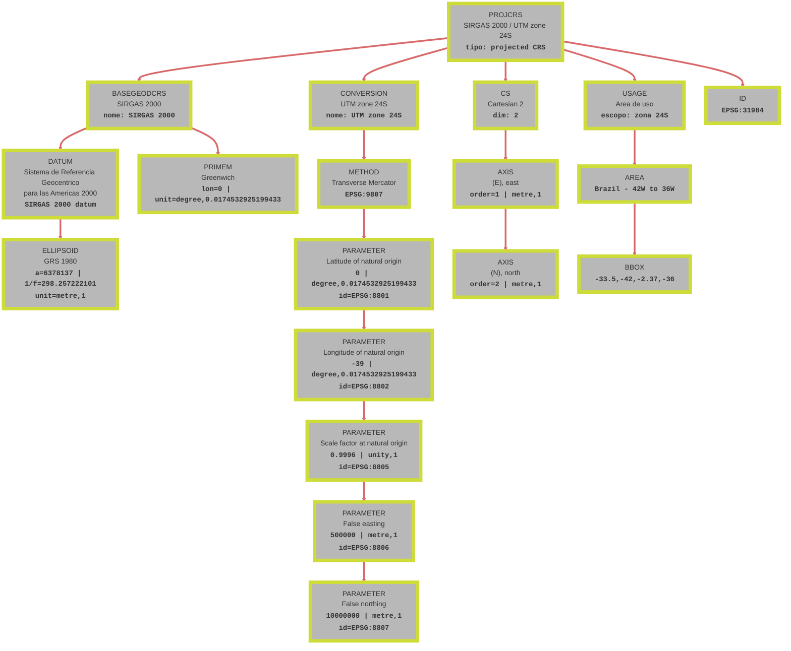
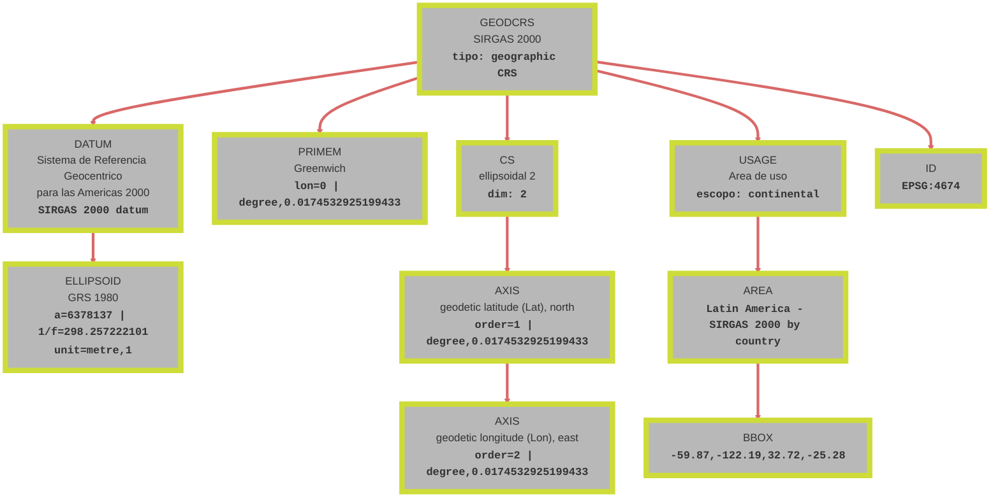

# Definição de um sistema de coordenadas

Um dos elementos principais para a definição e descrição de um sistema de projeção é o datum.

## O que é um Datum?

Em Sistemas de Informação Geográfica (SIG), um datum é um conjunto de parâmetros que define um sistema de referência para coordenadas geográficas. Ele especifica a forma da Terra (através de um elipsoide), o ponto de origem das coordenadas e a orientação dos eixos, garantindo consistência na localização de pontos na superfície terrestre. Os elementos principais de um datum incluem o elipsoide de referência (uma superfície matemática que aproxima a forma da Terra), o ponto de origem (centro de massa da Terra para datums geocêntricos ou um ponto de referência na superfície para sistemas projetados) e a orientação dos eixos (definindo a direção norte e a rotação). Além disso, o datum é uma parte fundamental da descrição de qualquer sistema de coordenadas, seja geográfico ou projetado, assegurando que as coordenadas sejam consistentes e interoperáveis entre diferentes aplicações e regiões. Datums são fundamentais para evitar erros em mapeamentos, navegação e integração de dados espaciais de diferentes fontes, pois diferentes datums podem resultar em deslocamentos significativos (até centenas de metros).

## Descrição do Sistema de Coordenadas

Para definir um sistema de coordenadas de forma precisa e interoperável, é necessário um conjunto de informações que incluem o datum de referência, o elipsoide usado, o meridiano principal, o método de projeção (se aplicável), os parâmetros da conversão, o sistema de coordenadas (cartesianas ou elipsoidais), as unidades e a área de validade. A representação Well-Known Text (WKT) é um padrão internacional para estruturar e representar essas informações de maneira legível por máquinas e humanos. A definição WKT do SIRGAS 2000 / UTM Zone 24S (EPSG:31984) apresentada abaixo é um exemplo prático dessas informações e de como elas são organizadas:

```
PROJCRS["SIRGAS 2000 / UTM zone 24S",
    BASEGEODCRS["SIRGAS 2000",
        DATUM["Sistema de Referencia Geocentrico para las Americas 2000",
            ELLIPSOID["GRS 1980",6378137,298.257222101,
                LENGTHUNIT["metre",1]]],
        PRIMEM["Greenwich",0,
            ANGLEUNIT["degree",0.0174532925199433]]],
    CONVERSION["UTM zone 24S",
        METHOD["Transverse Mercator",
            ID["EPSG",9807]],
        PARAMETER["Latitude of natural origin",0,
            ANGLEUNIT["degree",0.0174532925199433],
            ID["EPSG",8801]],
        PARAMETER["Longitude of natural origin",-39,
            ANGLEUNIT["degree",0.0174532925199433],
            ID["EPSG",8802]],
        PARAMETER["Scale factor at natural origin",0.9996,
            SCALEUNIT["unity",1],
            ID["EPSG",8805]],
        PARAMETER["False easting",500000,
            LENGTHUNIT["metre",1],
            ID["EPSG",8806]],
        PARAMETER["False northing",10000000,
            LENGTHUNIT["metre",1],
            ID["EPSG",8807]]],
    CS[Cartesian,2],
        AXIS["(E)",east,
            ORDER[1],
            LENGTHUNIT["metre",1]],
        AXIS["(N)",north,
            ORDER[2],
            LENGTHUNIT["metre",1]],
    USAGE[
        AREA["Brazil - 42°W to 36°W"],
        BBOX[-33.5,-42,-2.37,-36]],
    ID["EPSG",31984]]
```

!!! note
    O arquivo .prj de um shapefile carrega a mesma informação.

## Elementos de um Sistema de Coordenadas

A estrutura do WKT apresenta um aspecto de aninhamento (nesting), onde elementos contêm subelementos, refletindo a hierarquia do sistema de coordenadas. O diagrama abaixo ilustra os elementos desta estrutura para o EPSG:31984:



### PROJCRS

Projected Coordinate Reference System:
O PROJCRS indica que se trata de um sistema de coordenadas projetadas, ou seja, um sistema que transforma coordenadas geográficas (latitude e longitude) em coordenadas cartesianas planas (x, y), facilitando medições de distâncias e áreas em escalas locais. Esse tipo de sistema é essencial para mapeamento detalhado, pois minimiza distorções em regiões específicas, como a Bahia no Brasil.

### BASEGEODCRS

Base Geographic Coordinate Reference System:
O BASEGEODCRS define o sistema geográfico de base, que neste caso é o SIRGAS 2000. Ele serve como referência fundamental para o sistema projetado, fornecendo as coordenadas angulares (latitude e longitude) a partir das quais a projeção é aplicada. Sem essa base, não seria possível converter entre sistemas globais e locais com precisão.

### DATUM

O datum é o modelo matemático que define a forma da Terra e a posição de origem das coordenadas. O "Sistema de Referencia Geocentrico para las Americas 2000" (SIRGAS 2000) é um datum geocêntrico baseado em GPS, alinhado com o ITRF2000, garantindo alta precisão para toda a América Latina. Ele substituiu sistemas anteriores como o SAD69, reduzindo erros de posicionamento em até 200 metros.

### ELLIPSOID

O elipsoide é uma superfície matemática que aproxima a forma da Terra, definida por parâmetros como semi-eixo maior (6378137 metros) e achatamento (298.257222101). O GRS 1980 é um elipsoide geocêntrico moderno, usado globalmente, que fornece uma representação mais precisa da Terra do que elipsoides antigos, melhorando a acurácia em cálculos geodésicos e projeções cartográficas.

### PRIMEM

Prime Meridian:
O meridiano principal é a linha de referência longitudinal, definida como 0° no Observatório de Greenwich, Inglaterra. Esse ponto de origem permite a medição consistente de longitudes em todo o mundo, assegurando que coordenadas sejam comparáveis internacionalmente e evitando ambiguidades em sistemas de navegação e mapeamento.

### CONVERSION

 Conversão/Projeção:
A conversão descreve o método de projeção usado para transformar coordenadas geográficas em coordenadas planas. O Transverse Mercator é uma projeção cilíndrica oblíqua adequada para zonas estreitas, como as do UTM, preservando formas e ângulos em regiões alongadas. Parâmetros como longitude de origem (-39°), escala (0.9996) e falsos offsets (500000 E, 10000000 N) ajustam a projeção para minimizar distorções na zona 24S.

### CS

Coordinate System:
O sistema de coordenadas cartesianas define os eixos (E para leste, N para norte) e unidades (metros), permitindo medições métricas precisas. Esse sistema bidimensional é ideal para aplicações práticas como planejamento urbano e engenharia, onde distâncias absolutas são necessárias.

### USAGE

O uso (usage) especifica a área de aplicação válida do sistema, incluindo bounding box geográfica. Para a zona 24S, cobre o nordeste brasileiro, garantindo que o sistema seja usado apenas onde suas propriedades de precisão se aplicam, evitando erros em regiões fora dessa faixa.

## Comparação com EPSG:4674 (SIRGAS 2000 Geográfico)

O EPSG:4674 é o sistema geográfico correspondente ao SIRGAS 2000. A estrutura do WKT para sistemas geográficos é mais simples, sem projeção.

```
GEODCRS["SIRGAS 2000",
    DATUM["Sistema de Referencia Geocentrico para las Americas 2000",
        ELLIPSOID["GRS 1980",6378137,298.257222101,
            LENGTHUNIT["metre",1]]],
    PRIMEM["Greenwich",0,
        ANGLEUNIT["degree",0.0174532925199433]],
    CS[ellipsoidal,2],
        AXIS["geodetic latitude (Lat)",north,
            ORDER[1],
            ANGLEUNIT["degree",0.0174532925199433]],
        AXIS["geodetic longitude (Lon)",east,
            ORDER[2],
            ANGLEUNIT["degree",0.0174532925199433]],
    USAGE[
        AREA["Latin America - SIRGAS 2000 by country"],
        BBOX[-59.87,-122.19,32.72,-25.28]],
    ID["EPSG",4674]]
```

O diagrama abaixo ilustra essa hierarquia:



### Semelhanças
Ambos os sistemas compartilham o mesmo datum (SIRGAS 2000), elipsoide (GRS 1980) e meridiano principal (Greenwich), garantindo consistência na representação da forma da Terra e origem das coordenadas. Eles são baseados em GPS moderno e cobrem regiões similares da América Latina, facilitando a interoperabilidade entre dados geográficos.

### Diferenças
O EPSG:31984 é um sistema projetado (PROJCRS), convertendo coordenadas angulares em cartesianas planas para uso local preciso, enquanto o EPSG:4674 é geográfico (GEODCRS), mantendo coordenadas em latitude/longitude para escalas globais. O projetado inclui parâmetros de conversão (Transverse Mercator) e offsets falsos, adequados para medições métricas, mas com distorções crescentes à medida que se afasta da zona central. O geográfico é mais simples, sem projeção, mas menos preciso para distâncias locais devido à curvatura da Terra.


