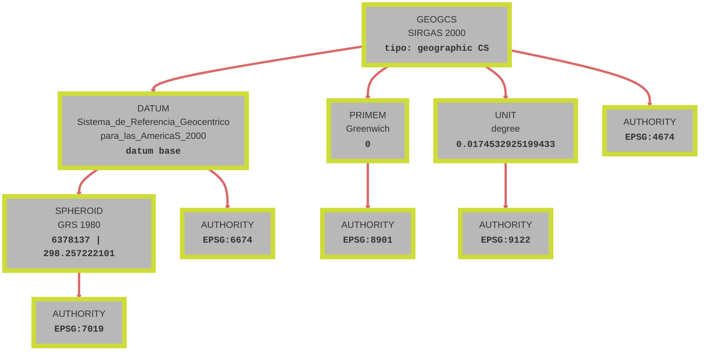

# Definição de um sistema de coordenadas

Um dos elementos principais para a definição e descrição de um sistema de projeção é o datum.

## O que é um Datum?

Em Sistemas de Informação Geográfica (SIG), um datum é um conjunto de parâmetros que define um sistema de referência para coordenadas geográficas. Ele especifica a forma da Terra (através de um elipsoide), o ponto de origem das coordenadas e a orientação dos eixos, garantindo consistência na localização de pontos na superfície terrestre. Os elementos principais de um datum incluem o elipsoide de referência (uma superfície matemática que aproxima a forma da Terra), o ponto de origem (centro de massa da Terra para datums geocêntricos ou um ponto de referência na superfície para sistemas projetados) e a orientação dos eixos (definindo a direção norte e a rotação). Além disso, o datum é uma parte fundamental da descrição de qualquer sistema de coordenadas, seja geográfico ou projetado, assegurando que as coordenadas sejam consistentes e interoperáveis entre diferentes aplicações e regiões. Datums são fundamentais para evitar erros em mapeamentos, navegação e integração de dados espaciais de diferentes fontes, pois diferentes datums podem resultar em deslocamentos significativos (até centenas de metros).

## Descrição do Sistema de Coordenadas

Para definir um sistema de coordenadas de forma precisa e interoperável, é necessário um conjunto de informações que incluem o datum de referência, o elipsoide usado, o meridiano principal, o método de projeção (se aplicável), os parâmetros da conversão, o sistema de coordenadas (cartesianas ou elipsoidais), as unidades e a área de validade. A representação Well-Known Text (WKT) é um padrão internacional para estruturar e representar essas informações de maneira legível por máquinas e humanos. A definição WKT do SIRGAS 2000 / UTM Zone 24S ([EPSG:31984](https://epsg.io/31984)) apresentada abaixo é um exemplo prático dessas informações e de como elas são organizadas:

```shell
PROJCS["SIRGAS 2000 / UTM zone 24S",
    GEOGCS["SIRGAS 2000",
        DATUM["Sistema_de_Referencia_Geocentrico_para_las_AmericaS_2000",
            SPHEROID["GRS 1980",6378137,298.257222101],
            TOWGS84[0,0,0,0,0,0,0]],
        PRIMEM["Greenwich",0,
            AUTHORITY["EPSG","8901"]],
        UNIT["degree",0.0174532925199433,
            AUTHORITY["EPSG","9122"]],
        AUTHORITY["EPSG","4674"]],
    PROJECTION["Transverse_Mercator"],
    PARAMETER["latitude_of_origin",0],
    PARAMETER["central_meridian",-39],
    PARAMETER["scale_factor",0.9996],
    PARAMETER["false_easting",500000],
    PARAMETER["false_northing",10000000],
    UNIT["metre",1,
        AUTHORITY["EPSG","9001"]],
    AXIS["Easting",EAST],
    AXIS["Northing",NORTH],
    AUTHORITY["EPSG","31984"]]
```

!!! note
    O arquivo .prj de um shapefile carrega a mesma informação.

## Elementos de um Sistema de Coordenadas

A estrutura do WKT apresenta um aspecto de aninhamento (nesting), onde elementos contêm subelementos, refletindo a hierarquia do sistema de coordenadas. O diagrama abaixo ilustra os elementos desta estrutura para o [EPSG:31984](https://epsg.io/31984):

```mermaid
%%{init: {"securityLevel":"loose","flowchart":{"htmlLabels":true},"themeCSS": ".arrowheadPath{fill:#D96868!important;transform:scale(2.2);transform-origin:center;}"}}%%
graph TD
    A["PROJCS<br/>SIRGAS 2000 / UTM zone 24S<br/><span style='background:#b8b8b8;padding:2px 6px;border-radius:4px;border:1px solid #D96868;color:#D96868;font-weight:700;font-family:Consolas,monospace;display:inline-block;'>tipo: projected CS</span>"] --> B["GEOGCS<br/>SIRGAS 2000<br/><span style='background:#b8b8b8;padding:2px 6px;border-radius:4px;border:1px solid #D96868;color:#D96868;font-weight:700;font-family:Consolas,monospace;display:inline-block;'>base geográfica</span>"]
    A --> C["PROJECTION<br/>Transverse_Mercator<br/><span style='background:#b8b8b8;padding:2px 6px;border-radius:4px;border:1px solid #D96868;color:#D96868;font-weight:700;font-family:Consolas,monospace;display:inline-block;'>método da projeção</span>"]
    A --> P1["PARAMETER<br/>latitude_of_origin<br/><span style='background:#b8b8b8;padding:2px 6px;border-radius:4px;border:1px solid #D96868;color:#D96868;font-weight:700;font-family:Consolas,monospace;display:inline-block;'>0</span>"]
    A --> P2["PARAMETER<br/>central_meridian<br/><span style='background:#b8b8b8;padding:2px 6px;border-radius:4px;border:1px solid #D96868;color:#D96868;font-weight:700;font-family:Consolas,monospace;display:inline-block;'>-39</span>"]
    A --> P3["PARAMETER<br/>scale_factor<br/><span style='background:#b8b8b8;padding:2px 6px;border-radius:4px;border:1px solid #D96868;color:#D96868;font-weight:700;font-family:Consolas,monospace;display:inline-block;'>0.9996</span>"]
    A --> P4["PARAMETER<br/>false_easting<br/><span style='background:#b8b8b8;padding:2px 6px;border-radius:4px;border:1px solid #D96868;color:#D96868;font-weight:700;font-family:Consolas,monospace;display:inline-block;'>500000</span>"]
    A --> P5["PARAMETER<br/>false_northing<br/><span style='background:#b8b8b8;padding:2px 6px;border-radius:4px;border:1px solid #D96868;color:#D96868;font-weight:700;font-family:Consolas,monospace;display:inline-block;'>10000000</span>"]
    P5 --> U1["UNIT<br/>metre<br/><span style='background:#b8b8b8;padding:2px 6px;border-radius:4px;border:1px solid #D96868;color:#D96868;font-weight:700;font-family:Consolas,monospace;display:inline-block;'>1</span>"]
    U1 --> X1["AXIS<br/>Easting<br/><span style='background:#b8b8b8;padding:2px 6px;border-radius:4px;border:1px solid #D96868;color:#D96868;font-weight:700;font-family:Consolas,monospace;display:inline-block;'>EAST</span>"]
    X1 --> X2["AXIS<br/>Northing<br/><span style='background:#b8b8b8;padding:2px 6px;border-radius:4px;border:1px solid #D96868;color:#D96868;font-weight:700;font-family:Consolas,monospace;display:inline-block;'>NORTH</span>"]
    X2 --> AU0["AUTHORITY<br/><span style='background:#b8b8b8;padding:2px 6px;border-radius:4px;border:1px solid #D96868;color:#D96868;font-weight:700;font-family:Consolas,monospace;display:inline-block;'>EPSG:31984</span>"]

    B --> B1["DATUM<br/>Sistema_de_Referencia_Geocentrico<br/>para_las_AmericaS_2000<br/><span style='background:#b8b8b8;padding:2px 6px;border-radius:4px;border:1px solid #D96868;color:#D96868;font-weight:700;font-family:Consolas,monospace;display:inline-block;'>datum base</span>"]
    B --> B2["PRIMEM<br/>Greenwich<br/><span style='background:#b8b8b8;padding:2px 6px;border-radius:4px;border:1px solid #D96868;color:#D96868;font-weight:700;font-family:Consolas,monospace;display:inline-block;'>0</span>"]
    B --> B3["UNIT<br/>degree<br/><span style='background:#b8b8b8;padding:2px 6px;border-radius:4px;border:1px solid #D96868;color:#D96868;font-weight:700;font-family:Consolas,monospace;display:inline-block;'>0.0174532925199433</span>"]
    B --> AU1["AUTHORITY<br/><span style='background:#b8b8b8;padding:2px 6px;border-radius:4px;border:1px solid #D96868;color:#D96868;font-weight:700;font-family:Consolas,monospace;display:inline-block;'>EPSG:4674</span>"]

    B1 --> S1["SPHEROID<br/>GRS 1980<br/><span style='background:#b8b8b8;padding:2px 6px;border-radius:4px;border:1px solid #D96868;color:#D96868;font-weight:700;font-family:Consolas,monospace;display:inline-block;'>6378137 | 298.257222101</span>"]
    B1 --> T1["TOWGS84<br/><span style='background:#b8b8b8;padding:2px 6px;border-radius:4px;border:1px solid #D96868;color:#D96868;font-weight:700;font-family:Consolas,monospace;display:inline-block;'>0,0,0,0,0,0,0</span>"]

    B2 --> AU2["AUTHORITY<br/><span style='background:#b8b8b8;padding:2px 6px;border-radius:4px;border:1px solid #D96868;color:#D96868;font-weight:700;font-family:Consolas,monospace;display:inline-block;'>EPSG:8901</span>"]
    B3 --> AU3["AUTHORITY<br/><span style='background:#b8b8b8;padding:2px 6px;border-radius:4px;border:1px solid #D96868;color:#D96868;font-weight:700;font-family:Consolas,monospace;display:inline-block;'>EPSG:9122</span>"]
    U1 --> AU4["AUTHORITY<br/><span style='background:#b8b8b8;padding:2px 6px;border-radius:4px;border:1px solid #D96868;color:#D96868;font-weight:700;font-family:Consolas,monospace;display:inline-block;'>EPSG:9001</span>"]

    linkStyle default stroke:#D96868,stroke-width:4px;
    classDef limeBox fill:#b8b8b8,stroke:#cddc39,stroke-width:8px;
    A:::limeBox
    B:::limeBox
    C:::limeBox
    P1:::limeBox
    P2:::limeBox
    P3:::limeBox
    P4:::limeBox
    P5:::limeBox
    U1:::limeBox
    X1:::limeBox
    X2:::limeBox
    AU0:::limeBox
    B1:::limeBox
    B2:::limeBox
    B3:::limeBox
    AU1:::limeBox
    S1:::limeBox
    T1:::limeBox
    AU2:::limeBox
    AU3:::limeBox
    AU4:::limeBox
```



### PROJCS

O `PROJCS` define o sistema projetado completo. No caso do diagrama, ele descreve como passar de coordenadas geográficas do SIRGAS 2000 para coordenadas planas UTM zona 24S. Ele reúne a base geográfica (`GEOGCS`), o método de projeção (`PROJECTION`), os parâmetros numéricos (`PARAMETER`), unidade linear (`UNIT`), orientação dos eixos (`AXIS`) e identificador oficial (`AUTHORITY`).

### GEOGCS

O `GEOGCS` é o sistema geográfico de referência usado como entrada da projeção. Aqui ele é `SIRGAS 2000`, ou seja, latitude/longitude sobre um datum geodésico moderno usado no Brasil.

### DATUM, SPHEROID e TOWGS84

O `DATUM` define o referencial geodésico. Dentro dele:

- `SPHEROID["GRS 1980", 6378137, 298.257222101]`:
    - `6378137` = semi-eixo maior do elipsoide (metros)
    - `298.257222101` = inverso do achatamento
- `TOWGS84[0,0,0,0,0,0,0]` indica transformação nula para WGS84, isto é, sem deslocamento/rotação/escala adicionais neste WKT.

Esses valores definem a geometria da Terra usada no cálculo da projeção.

### PRIMEM e UNIT (angular)

- `PRIMEM["Greenwich",0]`: meridiano de referência em `0°`.
- `UNIT["degree",0.0174532925199433]`: unidade angular e fator radiano do grau (`pi/180`).

Esses elementos definem como interpretar os ângulos geográficos antes da projeção.

### PROJECTION

`PROJECTION["Transverse_Mercator"]` define o método matemático da projeção UTM. Esse método transforma longitude/latitude em coordenadas planas preservando bem formas locais em faixas estreitas de longitude.

### PARAMETER

Os `PARAMETER` controlam numericamente a projeção:

- `latitude_of_origin = 0`: latitude de origem da projeção.
- `central_meridian = -39`: meridiano central da zona 24S.
- `scale_factor = 0.9996`: fator de escala no meridiano central (reduz distorções médias na zona).
- `false_easting = 500000`: deslocamento em X para evitar coordenadas negativas.
- `false_northing = 10000000`: deslocamento em Y no hemisfério sul.

Juntos, esses valores são os principais responsáveis por como a projeção UTM é “ajustada” para a região.

### UNIT e AXIS (linear)

- `UNIT["metre",1]`: unidade linear final em metros.
- `AXIS["Easting",EAST]` e `AXIS["Northing",NORTH]`: definem orientação e ordem dos eixos do plano projetado.

Isso determina como ler as coordenadas finais `(E, N)` no mapa projetado.

### AUTHORITY (EPSG)

Os blocos `AUTHORITY["EPSG", ...]` vinculam cada elemento a códigos oficiais EPSG:

- `31984` para o sistema projetado completo.
- `4674` para o sistema geográfico SIRGAS 2000.
- `8901`, `9122`, `9001` para meridiano, unidade angular e unidade linear.

Esses códigos garantem interoperabilidade entre softwares SIG e evitam ambiguidades na definição do sistema de coordenadas.

## Comparação com [EPSG:4674](https://epsg.io/4674) (SIRGAS 2000 Geográfico)

O [EPSG:4674](https://epsg.io/4674) é o sistema geográfico correspondente ao SIRGAS 2000. A estrutura do WKT para sistemas geográficos é mais simples, sem projeção.

```shell
GEOGCS["SIRGAS 2000",
    DATUM["Sistema_de_Referencia_Geocentrico_para_las_AmericaS_2000",
        SPHEROID["GRS 1980",6378137,298.257222101,
            AUTHORITY["EPSG","7019"]],
        AUTHORITY["EPSG","6674"]],
    PRIMEM["Greenwich",0,
        AUTHORITY["EPSG","8901"]],
    UNIT["degree",0.0174532925199433,
        AUTHORITY["EPSG","9122"]],
    AUTHORITY["EPSG","4674"]]
```

O diagrama abaixo ilustra essa hierarquia:



### Semelhanças
Os dois WKT são consistentes entre si no referencial geodésico e, por isso, podem ser usados juntos com baixa ambiguidade conceitual. Em ambos os casos, a base física e matemática da Terra é a mesma, mudando apenas a forma de representar as coordenadas.

- Datum comum: ambos usam `SIRGAS 2000` (família EPSG 4674/6674), garantindo a mesma referência geocêntrica para posicionamento.
- Elipsoide comum: ambos usam `GRS 1980` com os mesmos parâmetros (`a = 6378137`, `1/f = 298.257222101`), portanto a geometria de referência é idêntica.
- Meridiano principal comum: ambos adotam `Greenwich` (EPSG:8901) com longitude zero.
- Unidade angular comum na parte geográfica: ambos usam `degree` com fator `0.0174532925199433` (EPSG:9122).
- Conjunto EPSG coerente: os códigos de autoridade nos dois WKT são compatíveis e descrevem componentes equivalentes do mesmo sistema de referência.
- Interoperabilidade: como a base geodésica é a mesma, a transformação entre os dois formatos (geográfico e projetado) é estável e esperada em softwares SIG sem necessidade de mudança de datum.

### Diferenças
As diferenças principais estão na presença (ou ausência) de projeção cartográfica e no tipo de coordenada resultante.

- Tipo de sistema: [EPSG:4674](https://epsg.io/4674) é `GEOGCS` (coordenadas angulares), enquanto [EPSG:31984](https://epsg.io/31984) é `PROJCS` (coordenadas planas Easting/Northing).
- Estrutura WKT: o geográfico encerra em `GEOGCS` com `DATUM`, `PRIMEM`, `UNIT` e `AUTHORITY`; o projetado inclui essa base e adiciona `PROJECTION`, `PARAMETER`, `UNIT` linear, `AXIS` e `AUTHORITY` final do sistema projetado.
- Método cartográfico: no geográfico não há projeção (posição no elipsoide); no projetado há `Transverse_Mercator`, convertendo ângulos em métrica plana.
- Parâmetros de projeção (apenas no projetado): `latitude_of_origin = 0`, `central_meridian = -39`, `scale_factor = 0.9996`, `false_easting = 500000`, `false_northing = 10000000`.
- Unidade de saída: geográfico em graus; projetado em metros (`UNIT["metre",1]`, EPSG:9001).
- Uso analítico: o geográfico é ideal para integração e referência global; o projetado é mais apropriado para distância, área e trabalhos locais de engenharia/cadastro.
- Comportamento de distorção: o geográfico exige tratamento geodésico para medições; o projetado minimiza distorções na zona correta, com aumento progressivo longe do meridiano central.


